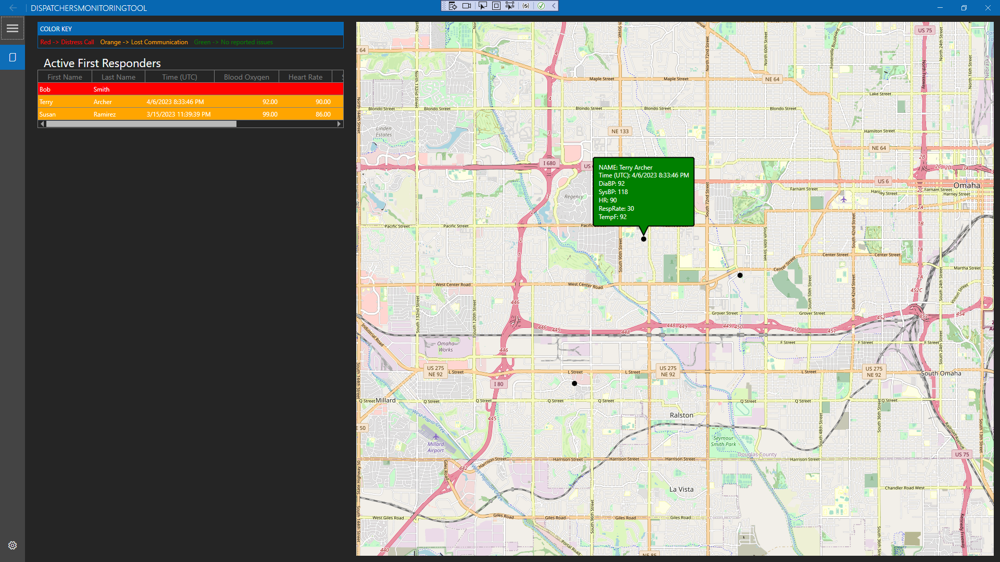

# CI-FirstResponders
This suite of applications will allow dispatchers to monitor vitals, distress status, and location of first responders.

## DistressML
This is a python program named DistressDetector.py that contains various machine learning classification models that will be tested on the dataset as the dataset improves, until the optimal one is discovered with the near-final dataset, after which the automated response system will be implemented.

## DataGenerator
This is a python program that will generate the dataset being used for this project, which at the moment can produce a dataset with mostly realistic values, though it still needs some work before it is as realistic as it can be. Once it is complete, the output will be used to build the finalize ML model. Please ignore the csv file in this folder - it is a much older example that will be deleted in future commits.

## DispatchersMonitoringTool
The dispatcher's monitoring tool interfaces with the results from the vitals and location monitoring performed by the distress detector and the mobile vitals monitoring tool. The first responders location is displayed in a map overlaying Open Street Maps, and the vitals and distress status is displayed in a table format.

  

## MobileVitalsMonitoringTool
The mobile application monitoring tool is responsible for reporting the location of the device where it is running from, first responder vitals information, and creating SOS alerts. This is the main interface that first responders will have access to request aid. The application will also use a system to automatically send out SOS alerts based on the first responder's vitals information. (Note that vitals information will come from the data generator described above).

# Release Notes

## Milestone 1

### DistressML and DataGenerator
* Dataset to train the machine learning model can be configured and built with a Python script.
* Machine learning model implementation in Python to test out different classification models to determine the best model.

### DispatchersMonitoringTool
* Added initial application template generated by Microsoft Template Studio, which includes app navigation, themes, and settings

### MobileVitalsMonitoringTool
* Added initital application template generated by Visual Studio. Template included multi-platform access, fly-out navigation bar, and basic nagivation pages.

## Milestone 2

### DistressML and DataGenerator
* Data generator can simulate virtual vitals data input in place of vitals data from actual first responders.
* Machine learning model has been built and implemented in ML.NET. Can return the distress status of first responders in test cases.

### DispatchersMonitoringTool
* Desktop application accesses database to display vitals in a datagrid  
* Desktop application accesses database to display location in a datagrid  

### MobileVitalsMonitoringTool
* No change. (All development for database, and shared library code done during this time)

## Milestone 3

### DistressML and DataGenerator
* Data generator has been updated to provide more realistic changes in vitals data over time.
* Machine learning model for automated distress has been improved with a larger dataset from 500 records to 1200.
* The Data generator application is fully functional locally, and now needs to proceed with integration into the mobile application.
* 
### DispatchersMonitoringTool
* Desktop application uses syncfusion to display location of first responders in a map  
* Desktop application displays vitals when hovering over a first responder in the map  
* Desktop application displays vitals in a high-performance data grid  

### MobileVitalsMonitoringTool
* Mobile application has log-in feauture to identify users based on worker ID.
* Mobile application use Geolocation, a library within Xamarin Essentials, to get the location of the device.
* Mobile application updates location entry in the database for the logged in user.
* Mobile application has SOS button to update the alert field in the database for the logged in user.

## Milestone 4

### DistressML and DataGenerator
* Data Generator file GenerateData.cs has been successfully implemented in the MobileVitalsMonitoringTool.
* Dataset accuracy has been improved by parsing and modifying records for more realistic examples.
* The machine learning model is fully functional locally, and now needs to proceed with integration into the mobile application.

### DispatchersMonitoringTool
* Desktop application updates data with SQL database automatically on an interval  
* Can view the location of a first responder in the map by selecting the first responder in the vitals datagrid  
* First responder rows are highlighted in the vitals DataGrid in red (distress), orange (lost communication), or green (normal status)  

### MobileVitalsMonitoringTool
* Mobile application has background service to get the user's location every couple of seconds while the user is logged in. (Android specific)
* Mobile applicatino has log-out feature. Log-in and log-out are also now directly tied with the active field in the database. A logged in user will have active=true and logged out users will have active=false;
* Mobile application has an alert page where users are navigated to after clicking the SOS button. This page includes a timer that will send the alert automatically if no action is taken.
* Mobile application updates vitals entry in the database for the logged in user. Vitals are being received by the data generator.

## Milestone 5

### DistressML and DataGenerator
* Machine learning implementation has been built in Python and complied with the ONNX framework to implement on the android mobile application. It has now been fully integrated into the central library.
* Doxygen documentation has been completed for both the machine learning model and data generator.

### DispatchersMonitoringTool
* code cleanup and additional documentation

### MobileVitalsMonitoringTool
* Mobile application is able to call the machine learning component to decide if an automatic alert is needed or not.
* Mobile application frequently checks if the logged in user has an active alert, and will take them to the alert page if this is the case.
* Basic UI changes completed.
* Thoroughly tested and the following bugs fixed: mobile app no longer spams user with multiple alert pages, only one alert page can be open at a time, eliminated the ability for users to double tap the SOS button which was causing undefined behavior, prevented already logged in users from being able to log in. 
